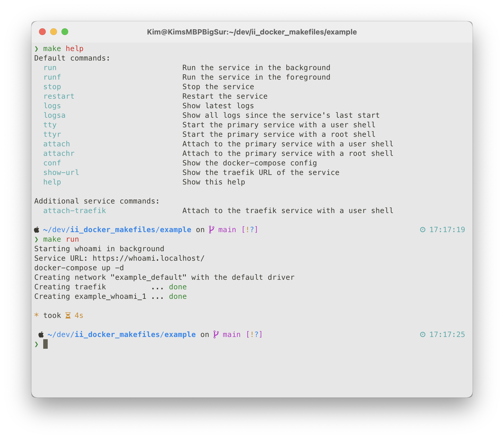

# Docker Makefiles

## Description

Makefiles that make working with docker easier and more convenient.

The Makefiles...

* Auto-generate a list of all available targets / commands that you can see by running `make help`

* Provide useful default commands such as `make run`, `make restart` and many more
* Allow you to add additional service-specific commands
* Allow you to override default commands
* Display the traefik URL of the service on start / restart



## How to setup your project

Take a look at the included [example](./example/) directory.

Inside, you will find an example `docker-compose.yml` and `Makefile` for a whoami service with traefik as the reverse proxy.

The `Makefile` has comments that explain all available settings and options.

Use that as a base to create a `Makefile` for your own project.

### 1. Install dependencies

These makefiles are designed to work with docker-compose based services. So you need docker and docker-compose.

You also need the yaml parser `yq` and `gawk` to allow parsing of the docker-compose config to display the configured traefik URL of your service.

```shell
# macOS
brew install yq gawk

# linux
# gawk should already be installed
# Install yq:
(export VERSION=v4.16.1 BINARY=yq_linux_amd64 && sudo wget "https://github.com/mikefarah/yq/releases/download/${VERSION}/${BINARY}" -O /usr/bin/yq && sudo chmod +x /usr/bin/yq)
```

### 2. Clone this project

You will need to add this repo to your project. You can either clone it...

```shell
# Clone this project
git clone https://github.com/Infused-Insight/docker_makefiles.git
echo '/docker_makefiles' >> .gitignore
```

Or add it as a submodule...

```shell
git submodule add https://github.com/Infused-Insight/docker_makefiles.git
git commit -m "Added docker_makefiles submodule"
```

### 3. Add your makefile

Create a `Makefile` using the code below as a template:

* Make sure to adjust the `include` paths to the cloned directory.
* Set the `PS` variable to the most important service in your `docker-compose.yml`

```Makefile
# Run `make help` to get full list of available commands.
# Many targets are in the included makefiles.

# Default make targets (Required)
# These are the built-in commands that should be made available.
# The order in which you put them, is the order in which they will appear
# in the help.
include docker_makefiles/docker.mk
include docker_makefiles/help.mk

# Primary Service configuration (Required)
# Some commands, such as `make attach` target a specific service.
# This defines, which service should be used by default.
# If you want to target another one, you can override it in the command
# with `make attach PS=traefik`
PS = whoami

# Primary Service Shell (Optional)
# By default `make attach` and `make tty` run bash in the containers.
# But since some docker images don't have bash installed, you can use this
# to change it.
PS_SHELL = /bin/sh

# Set `help` as the default command (Optional)
# Include this if you want running `make` to output the help instead of
# running `make build`
.DEFAULT_GOAL := help

# Additional make targets (Optional)
# Add custom targets like this.
# By adding a comment, you make them appear in the help
attach-traefik: ## Attach to the traefik service with a user shell
	docker-compose exec "traefik" /bin/sh

# Override default targets (Optional)
# You can replace default targets by simply reimplementing them in
# your Makefile.
# Leave out the comment to make sure it doesn't show up twice in the help.
log:
	@echo "3.6 roentgen, not great, not terrible..."
```

## How to use it

### Show the help

Run `make help` to get a list of available commands.

### Run commands

Simply execute `make xxx`, such as `make run` or `make restart`.

### Add your own commands

Simply add them to your `Makefile` like any other make target.

If you add a comment with `## ` after the target name, the command will appear in the help.

```Makefile
attach-traefik: ## Attach to the traefik service with a user shell
	docker-compose exec "traefik" /bin/sh
```

### Overwrite existing commands

To overwrite an existing command, just add it with the same name.

Don't include the help comment to ensure it doesn't show up in the help twice.

```Makefile
log:
	@echo "3.6 roentgen, not great, not terrible..."
```

### Info for multi-service setups

Oftentimes, your docker-compose config will contain multiple services. For example when you are running a web application and a database in one config.

But some commands need to run on a specific container, such as `make attach` (which gives you a shell inside a running container).

You need to set which should be the primary container using the `PS` variable in your Makefile.

In the example project the primary service is set to `whoami`:
```Makefile
PS = whoami
```

But if you wanted to get a shell inside the traefik container, you could overwrite it from the command line using `make attach PS=traefik`.

### Change the default shell

By default the commands `make tty` and `make attach` execute `bash` in the container.

But some docker images don't include `bash` and instead only ship with `sh`.

You can change the default shell by setting the `PS_SHELL` variable in in your `Makefile`:
```Makefile
PS_SHELL = /bin/sh
```

### Set the default make target
By default running `make` (without a target) is the equivalent of executing `make build`.

If you want to change this to display the help instead, add the following line to your `Makefile`:

```Makefile
.DEFAULT_GOAL := help
```